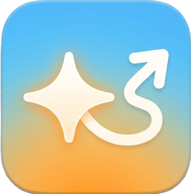
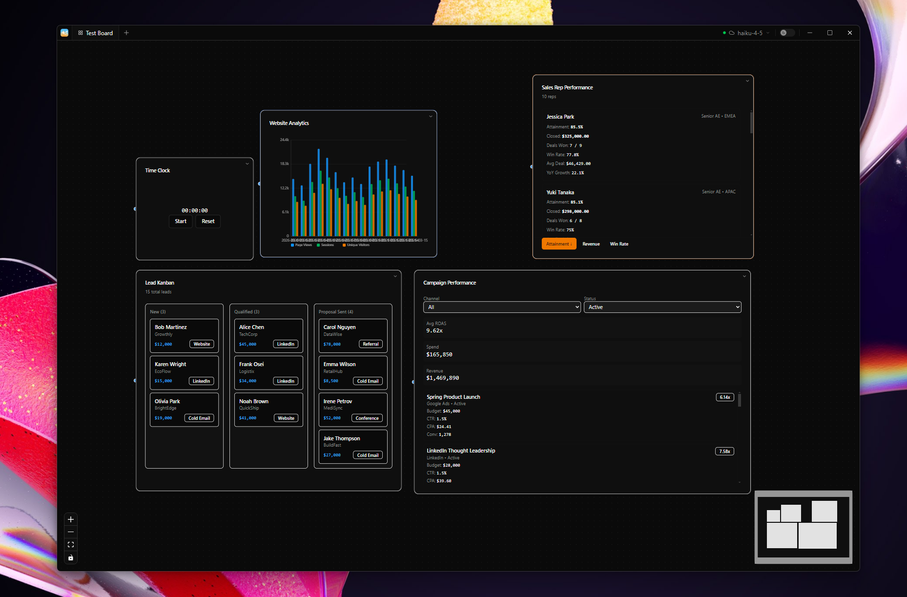

<p align="center">
  
</p>

<h1 align="center">SparkFlow</h1>

<p align="center">
  <strong>AI-Powered Microapp Canvas</strong><br>
  Drop data, describe what you need, get a live interactive app on an infinite canvas.
</p>

<p align="center">
  
</p>

## What is SparkFlow?

SparkFlow is a desktop app that combines an infinite canvas with AI-generated micro-applications. Drag in your data (Excel, CSV), describe what you want in plain language, and SparkFlow generates a fully interactive app — dashboards, kanban boards, data tables, analytics tools, and more — right on your canvas.

### Key Features

- **AI-Generated Microapps** — Describe what you need, get a working React app in seconds
- **Infinite Canvas** — Arrange, resize, and connect multiple apps freely
- **Live Data Sources** — Import Excel/CSV files with automatic column detection and live file watching
- **Mutable Data** — Microapps can read and write back to data sources
- **Built-in Charts** — Bar, line, area, and pie charts auto-adapt to your data
- **Persistent Storage** — Microapp state, tables, and data survive restarts
- **File Operations** — Microapps can read/write files through native OS dialogs
- **Notifications** — Toast system for user feedback
- **Multiple Boards** — Organize work across tabbed boards
- **Light/Dark Mode** — System-aware with manual toggle
- **Local-first AI** — Runs Ollama locally, or connect to Anthropic's API
- **Frameless Window** — Custom titlebar with board tabs

## Getting Started

### Prerequisites

- [Node.js](https://nodejs.org/) 18+
- [Git](https://git-scm.com/)

### Install & Run

```bash
git clone https://github.com/pontus-espe/sparkflow.git
cd sparkflow
npm install
npm run dev
```

### Build for Production

```bash
# Build the renderer + main process
npm run build

# Package as a distributable (output in dist-electron/)
npm run pack
```

## Architecture

| Layer | Tech |
|-------|------|
| Framework | Electron + React 19 + TypeScript |
| Build | electron-vite 5.0 + Sucrase |
| Canvas | @xyflow/react |
| Styling | Tailwind CSS 4 |
| State | Zustand (4 stores: board, microapp, data, AI) |
| Database | sql.js (WASM SQLite) |
| AI Runtime | electron-ollama (bundled) or Anthropic API |

### Microapp SDK

AI-generated microapps run in a sandboxed `new Function()` environment with a controlled standard library:

| Category | APIs |
|----------|------|
| React | `useState`, `useEffect`, `useCallback`, `useMemo`, `useRef` |
| Persistence | `useAppState(key, default)`, `useTable(name)`, `useData(sourceId?)` |
| Charts | `UI.BarChart`, `UI.LineChart`, `UI.AreaChart`, `UI.PieChart` |
| UI Components | `UI.Button`, `UI.Input`, `UI.Card`, `UI.Badge`, `UI.Checkbox`, `UI.Tabs` |
| File I/O | `file.readText()`, `file.writeJSON()`, `file.writeCSV()`, etc. |
| Notifications | `notify(message, type?)` |
| Utilities | `utils.formatDate()`, `utils.formatNumber()`, `utils.groupBy()`, `utils.sortBy()`, `utils.sum()` |

### Project Structure

```
electron/           # Main process
  main.ts           # Window creation, IPC setup
  preload.ts        # Context bridge
  data/             # Database, file parsing, file watching
  ipc/              # IPC handlers (data, board, ollama, files)
  ollama/           # Bundled Ollama runtime
src/                # Renderer process
  components/
    canvas/         # React Flow canvas + node types
    microapp/       # Microapp renderer, runtime/stdlib
    ui/             # Shadcn UI components + charts
    ai/             # Command palette, model settings
  stores/           # Zustand stores
  services/         # IPC client, compiler, generation
  lib/              # Utilities, AI prompt templates
  types/            # TypeScript type definitions
shared/             # IPC channel constants
```

## License

[MIT](LICENSE)
